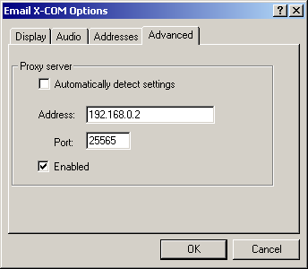

# HasbroPBEMProxy
_Greg Kennedy, 2021_

Server emulator for the Hasbro Em@il Games clients

## About
In 1999 Hasbro launched a series of games under the "Em@il Games" banner, allowing users with limited internet connections to play a handful of turn-based games using their existing email address.  A player would begin a new game from the app on their computer, make moves, and submit them to Hasbro's servers by clicking a button.  Hasbro would then send an email to the opponent with a .bin snapshot of the gamestate and an "it's your turn!" message.  From there the opponent would check their email, see an attached savegame, double-click to launch and make moves, and submit their updates back to the first opponent (again, through Hasbro's servers).

The servers folded in 2001.  This rendered the games nearly unplayable, except for certain [workarounds](http://worldofstuart.excellentcontent.com/excom.htm) involving retrieving the savegame from a temp folder and passing it around manually.  Most games in the series were board game conversions and not very interesting, but there was a lesser-known X-Com tactical game that still may be worth playing today.

**This project is an attempt to revive the game servers to enable easier exchange of the savegames** without needing to dig around in folders anywhere.  This is done by using the "Proxy Server" settings in a game, like so:



A Proxy Server is intended to act as a middleman for HTTP connections: instead of sending your requests to a remote website directly, you instead pass them to the proxy server, which forwards the request (and response) on your behalf.  This is helpful for privacy, website allow/deny listing, etc.  The Hasbro games support a proxy, but do not use HTTPS (SSL) for the connection.  It is thus very easy to write our own bogus proxy service that captures the request and instead serves its own response.  By faking the response as though it is an actual Hasbro server, the proxy can capture and exchange gamestates, while the application thinks it's just gotten off the phone with Hasbro.

## Supported Games
The following games are currently supported by the proxy:

* Email X-Com (aka EX-COM aka X-Com: First Alien Encounter).
* Email NASCAR
* Email NFL Football
* Email Clue / Cluedo
* Email Scrabble

I am interested in other games in the Em@il Games series, and may add support for those in the future.

## Details
Submitting a turn involves sending a specially crafted HTTP request to a formatted URL at one of two hardcoded IP addresses.  For X-Com, the primary IP is `128.11.41.76`, and if any part of the request fails it makes another identical attempt at `128.11.41.77` instead.

The URL format is:
http://128.11.41.76:80/1632633091/776.htm
where the first path parameter is a `time32_t` Unix timestamp, and the second is milliseconds.

An example web request made by the client looks like this:
```
GET http://128.11.41.76:80/1632635052/35.htm HTTP/1.0
User-Agent: Hasbro/2.0 (compatible; EmailGame 57.57; Windows 95)
Host: 128.11.41.76:80
Pragma: no-cache
Cookie: HasbroCookieVR1=AAAAcAAAOTkAAAAQAAAAAAAAAAAAAAAAAAAAAAAAAAAAAAAAAAAAAAAAAAAAAAAAAAAAAAAAAAAAAAAAAAAAAAAAAAAAAAAAAAAAAAAAAAEAAAAAAAAAAGFQCI4A7v8MAAAAAQAAAAAgoeADWIH3dgAABClWPhf/qcEZSyHB86VbcS7Ek5ZEfhLS8NLrJk1wYDcO5UJsk7/nJrdq29WNak4h5NjzzSVZB8yoi342XNbakHBXE+DQ8GRfNILH1f0gSXirwo1eRW6TwOsWO2adtt0CMViPrEf/J1J7osn2HURrmMPuEzpgjrXlCSRahKfX/yodBOHM9RtHcpzC6Rg9ZIm44wYzzoSu1QMpUHikz/MfSnSaxegVPGOQt+MLMlyGpd0BKA8D5873JklwncTvHz9qm7rhADXMhrDbAStWfqbN/iFIdZzD7RdCapK14Q0wXoi72QMugQDl0PklS3aaxu0IQWifvOcCN/KIstkALVR7qNP8I05znsHyGUBplLPlDz5girneBSzH/uvS+yJNdJnI8xFDbpm+5Rw58Iq03wcvWoCq0fklTHKgz/EbRm6WseoRPGKMv9oHMkH96dT9IE96p8rxEUVslsDrHjv2jLbdDDFYh6zX/SdSeqLN9x1EbJjP7hMqZI614gkwWISv0v8qVHqhyvUcRnCTkod1RAP9mNMKJCzpz65lW2A7wbWXcjgd/+2PelNn4LjiCTJdgKnYA4osPqXO8yBLdpvG7xY9ZZG45wynX4ey2wIpVn2ky/gjTnOawO4VRWmcveQfPV+KRVpBLFV4p9L/Ikl1ncTmGENuky7kDjVjibDYBC9Xf6rQ+iVKdZzB8BdFa4a15g0Q4ciz3AMuVYap0PokT3CfyvUa0W2VvOYQO2OLttgGLV2BrNf8J0p3rsHyCU1tlNNoUzpji7XcADBbgavW/iZNfKFY8hxHapfC7RI5Yo202Qg3WIOu1/4pWXmwzPQfohDaweoXPGeKt+IKMlmCrdT7KMN7o873HkVymcDtFD9gj77iCjFfhaDcADtYe6Z9dl1IcZzD7hM+ZZW54Ao0X4KvSgAqUXilzPMgS3Gbxu4WOWuRuOAMO1SHntgCITYRyayTUmQR8bXuEiYPkKpa36b5IR0VzOOaGMG5kZ2Y5jtvQyOOpVzagw0lz/cOC+A+YLBkHpxFEtkgFUXQH3isjtU8WG2PoGPWefEpBX7oiOHOMmVcqj79MBRKqJTPJg2NV7YMGThXqLz37vCYOJbe4AwydZyg7kY4RIqr46+Fgma91C6M5Emb3sUsa0K5kM8mHXSjivEoAXhTiv3UD2aoFVIOjNXZPPNQvYTTJptd4suwmedrtZUDOtJ32fOkjXJbqUN31sX8k78H0GZPNB1r9Dkph75VDEVKWAH239E5+2pKYBc4g1lwqcL774a9rwsi2Q/BPRZPoJmRSH8WzeSYTA9jVI3m387F7AVAa5O75gowW3ex2gIswHCn0vwiS4Wbxu/qSWtgteT6N2CNStsEKK98rCn5JrV3mDLyHrRunkzgBcppgUDVDtpXyctHz40FE/OknjZjG/rMi3QYYnkAAAACAAAACVBsYXllciAxAAAAABRwbGF5ZXIxQGV4YW1wbGUuY29tAAAAAAlQbGF5ZXIgMgAAAAAUcGxheWVyMkBleGFtcGxlLmNvbQA=
Accept-Language: en-us
```

The interesting portion here is the cookie `HasbroCookieVR1`, containing a Base64-encoded binary structure with information about the to/from email addresses, game snapshot, and other information.  This is similar to a POST request with the same information in the body.

The server response is parsed for certain HTML tags - mainly, a `<PRE>` block with a Base64-encoded server binary response.  A sample response accepted by the client looks like this:

```
HTTP/1.0 200 OK
Date: Sun, 26 Sep 2021 05:49:53 +0000
Content-Length: 1658

<HTML><TITLE>title</TITLE><BODY><PRE>
AAAAAAAAAAAAAAADAO7/DAAAAAAAAAAAAAAAAAAAAAAAAAAAAAAAAAAAAAAAAAAAAAAAAAAAAAAA
AAAAAAAAAAAAAAAAAAAAAAAAAAAAAAAAAAAAAAAAAAAAAAAAAAAAAAAAAHRlbXB4ZW0AAAAEKVY+
F/+pwRlLIcHzpVtxLsSTlkR+EtLw0usmTXBgNw7lQmyTv+cmt2rb1Y1qTiHk2PPNJVkHzKiLfjZc
1tqQcFcT4NDwZF80gsfV/SBJeKvCjV5FbpPA6xY7Zp223QIxWI+sR/8nUnuiyfYdRGuYw+4TOmCO
teUJJFqEp9f/Kh0E4cz1G0dynMLpGD1kibjjBjPOhK7VAylQeKTP8x9KdJrF6BU8Y5C34wsyXIal
3QEoDwPnzvcmSXCdxO8fP2qbuuEANcyGsNsBK1Z+ps3+IUh1nMPtF0JqkrXhDTBeiLvZAy6BAOXQ
+SVLdprG7QhBaJ+85wI38oiy2QAtVHuo0/wjTnOewfIZQGmUs+UPPmCKud4FLMf+69L7Ik10mcjz
EUNumb7lHDnwirTfBy9agKrR+SVMcqDP8RtGbpax6hE8Yoy/2gcyQf3p1P0gT3qnyvERRWyWwOse
O/aMtt0MMViHrNf9J1J6os33HURsmM/uEypkjrXiCTBYhK/S/ypUeqHK9RxGcJOSh3VEA/2Y0wok
LOnPrmVbYDvBtZdyOB3/7Y96U2fguOIJMl2AqdgDiiw+pc7zIEt2m8bvFj1lkbjnDKdfh7LbAilW
faTL+CNOc5rA7hVFaZy95B89X4pFWkEsVXin0v8iSXWdxOYYQ26TLuQONWOJsNgEL1d/qtD6JUp1
nMHwF0VrhrXmDRDhyLPcAy5VhqnQ+iRPcJ/K9RrRbZW85hA7Y4u22AYtXYGs1/wnSneuwfIJTW2U
02hTOmOLtdwAMFuBq9b+Jk18oVjyHEdql8LtEjlijbTZCDdYg67X/ilZebDM9B+iENrB6hc8Z4q3
4goyWYKt1Psow3ujzvceRXKZwO0UP2CPvuIKMV+FoNwAO1h7pn12XUhxnMPuEz5llbngCjRfgq9K
ACpReKXM8yBLcZvG7hY5a5G44Aw7VIee2AIhNhHJrJNSZBHxte4SJg+QqlrfpvkhHRXM45oYwbmR
nZjmO29DI46lXNqDDSXP9w4L4D5gsGQenEUS2SAVRdAfeKyO1TxYbY+gY9Z58SkFfuiI4c4yZVyq
Pv0wFEqolM8mDY1XtgwZOFeovPfu8Jg4lt7gDDJ1nKDuRjhEiqvjr4WCZr3ULozkSZvexSxrQrmQ
zyYddKOK8SgBeFOK/dQPZqgVUg6M1dk881C9hNMmm13iy7CZ52u1lQM60nfZ86SNclupQ3fWxfyT
vwfQZk80HWv0OSmHvlUMRUpYAfbf0Tn7akpgFziDWXCpwvvvhr2vCyLZD8E9Fk+gmZFIfxbN5JhM
D2NUjebfzsXsBUBrk7vmCjBbd7HaAizAcKfS/CJLhZvG7+pJa2C15Po3YI1K2wQor3ysKfkmtXeY
MvIetG6eTOAFymmBQNUO2lfJIieZLQUT86SeNmMb+syLdBhieQAAAAA=
</PRE></BODY></HTML>
```

The client parses this and looks for certain flags indicating a successful response, then informs the user that submission was successful.  Most of the data in the response structure is not known, but some flags allow sending a custom error message, indicating error status, etc.

The server's task is to pass the turn snapshot (`.xem`) to the next player.  The original role of the Hasbro servers was to wrap this in an email message.  It is up to the dev to determine what to do with it in this case.  I have connected the output to a Discord webhook, which notifies the players and attaches the `.xem` for the opponent to pick up and play.

For details of the binary structure itself, please see the comments in the source code.

## Usage
The handoff server is written as a `.php` file which parses the cookie and constructs the response.  Setting this up requires a PHP-enabled web server, listening on the desired port and sending requests to the script.  Path parameters should be parsed into a single query parameter `timestamp` of form `seconds.milliseconds`.

For example, this `httpd.conf` VirtualHost directive for Apache listens to incoming requests on port 8080, and forwards them to the script residing in `/usr/local/www/pbemproxy/index.php`.  Adjust especially the FilesMatch portion if you use `mod_php` instead of an FPM service, etc:

```
<VirtualHost *:8080>
  ServerName 128.11.41.76
  ServerAlias 128.11.41.77

  DocumentRoot "/usr/local/www/pbemproxy"
  <Directory "/usr/local/www/pbemproxy">
    DirectoryIndex index.php

    # Controls who can get stuff from this server.
    Require all granted

    # Set up the PHP handler
    ProxyErrorOverride on
    <FilesMatch \.php$>
      SetHandler "proxy:unix:/tmp/php-fpm.sock|fcgi://localhost"
    </FilesMatch>

    RewriteEngine On
    RewriteRule "^(\d+)/(\d+)\.htm$" "/index.php?timestamp=$1.$2" [L]

  </Directory>
</VirtualHost>
```

Alternately, if you just want to *play* the game without any of this, there is a Discord server available with the correct setup.

Click here to join: https://discord.com/invite/xB4XsTeFta
